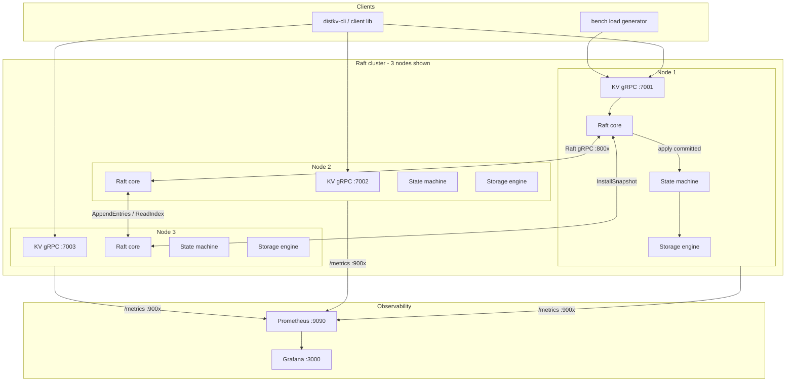
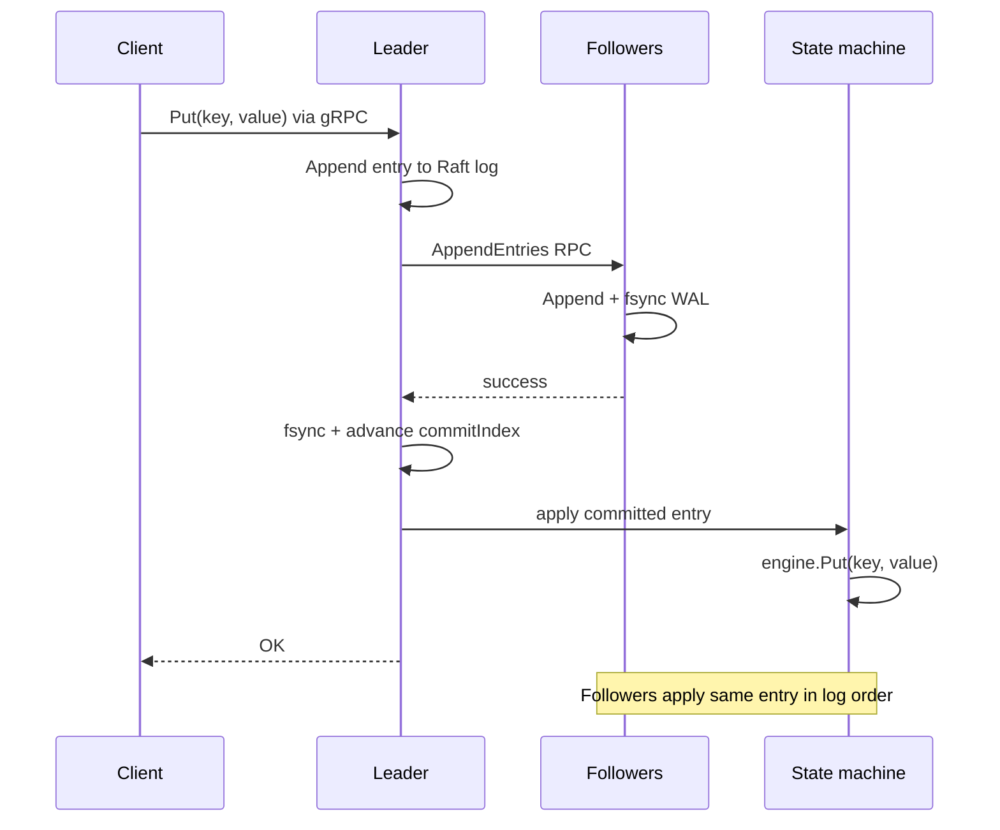
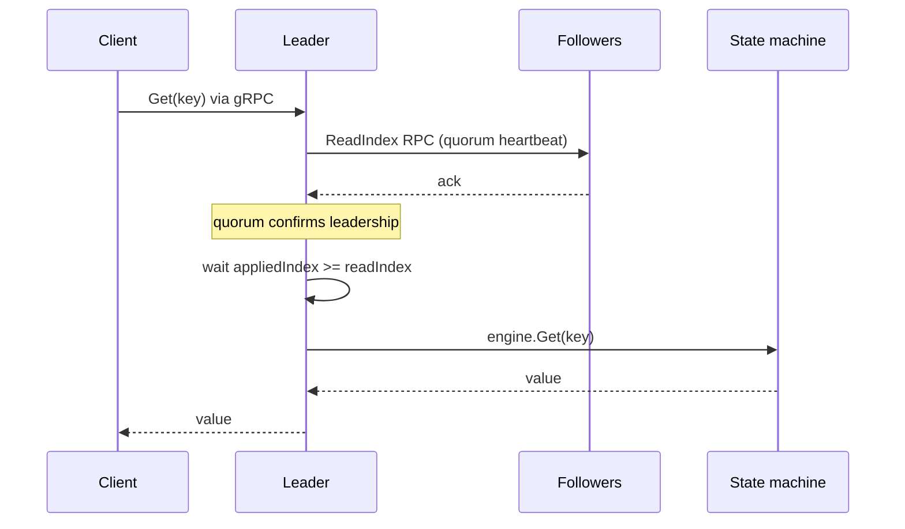

# DistKV


A fault-tolerant, linearizable distributed key-value store written in Go. DistKV
replicates every write across a Raft cluster using a from-scratch consensus
implementation (no etcd/Hashicorp libraries), persists data through a custom
LSM-style storage engine, and exposes a gRPC client API with Prometheus
metrics and Grafana dashboards.

**In one sentence:** a miniature production-style replicated database — the
same architectural pattern as etcd, built to be understood end-to-end.

---

## Table of contents

1. [Problem and goals](#problem-and-goals)
2. [Architecture](#architecture)
3. [Request paths](#request-paths)
4. [Components](#components)
5. [Consistency and fault tolerance](#consistency-and-fault-tolerance)
6. [Failure scenarios](#failure-scenarios)
7. [Design trade-offs](#design-trade-offs)
8. [Observability](#observability)
9. [Benchmarks](#benchmarks)
10. [Testing](#testing)
11. [Running DistKV](#running-distkv)
12. [Repository layout](#repository-layout)
13. [Future work](#future-work)

---

## Problem and goals

Build a **replicated state machine**: N nodes execute the same ordered log of
commands so that, despite crashes and network faults, clients see one coherent
key-value store.

| Goal | How DistKV achieves it |
|---|---|
| Durability | Raft log WAL + majority fsync before client ack |
| Consistency | Single Raft group, linearizable writes and reads |
| Availability | Tolerates ⌊N/2⌋ failures (1 of 3, 2 of 5, …) |
| Understandability | ~4k LOC Raft + storage, no consensus library |
| Operability | Prometheus metrics, Grafana dashboard, Docker Compose |

**Non-goals (v1):** multi-key transactions, geo-replication,
sharding across multiple Raft groups.

---

## Architecture

DistKV is a **single Raft group** of `N` peers. Each peer runs identical
software: a gRPC front-end, a Raft core, and a local storage engine. Clients
talk to any node; writes and linearizable reads go through the leader.



### Ports (default)

| Port | Service |
|---|---|
| 80 | Demo website (nginx → React UI + `/api`) |
| 7001–7003 | Client KV API (gRPC) |
| 8001–8003 | Inter-node Raft RPC (gRPC) |
| 9001–9003 | Prometheus `/metrics` (HTTP) |
| 9090 | Prometheus UI (`--profile monitoring`) |
| 3000 | Grafana UI (`--profile monitoring`) |

---

## Request paths

### Write path (`Put` / `Delete`)

Every mutation is a **Raft log entry**. The client only gets `OK` after the
entry is committed on a majority and applied locally.



Steps in code: `server.Put` → `propose` → `raft.Propose` → replication →
`applyLoop` → `stateMachine.apply` → `storage.Engine.Put`.

### Read path (`Get`) — ReadIndex

Reads do **not** append to the Raft log. The leader confirms it still holds
leadership via a quorum heartbeat, waits until the state machine has applied
through the read index, then reads locally.



This gives **linearizable reads** without a log write. Followers redirect
clients to the leader via `FailedPrecondition` + client-side retry.

### Exactly-once client retries

Clients attach `(client_id, seq)` to writes. The state machine tracks the
highest applied sequence per client and ignores duplicates — safe retries
during leader failover.

---

## Components

### Raft core (`raft/`)

Implemented from the Raft paper with production-oriented details:

- **Single event-loop goroutine** per node — timers, replication ticks, elections
- **Leader election** with randomized timeouts (150–300 ms)
- **Log replication** with conflict-term/index fast backtracking
- **Leader no-op entry** on election (Raft §5.4.2 — unblocks commit of prior-term entries)
- **Group-commit fsync** — batch concurrent appends into one disk sync
- **Snapshots + InstallSnapshot** for lagging followers and log compaction
- **Persistent state** — term, votedFor, log in a checksummed WAL; atomic WAL
  rewrite on snapshot

Raft RPCs: `RequestVote`, `AppendEntries`, `InstallSnapshot`, `ReadIndex`.

### Storage engine (`storage/`)

Pure-Go embedded LSM-style engine per node:

```
write → engine WAL → memtable (skiplist)
              ↓ flush when ~4 MB
         immutable SSTable (.sst) → background merge compaction
read  → memtable → SSTables (newest first)
```

- WAL records are CRC32-checksummed; torn tails discarded on replay
- Tombstones removed during full compaction
- Engine runs with `SyncWAL=false` — durability of unapplied commands comes
  from the Raft log, not the engine WAL

On-disk layout per node:

```
data/nX/
  raft/          ← consensus log, hard state, snapshots
  engine/        ← key-value data (engine.wal, *.sst)
```

### Server layer (`server/`)

- **KV gRPC service** — Put, Get, Delete, Status
- **Raft gRPC service** — inter-node transport
- **State machine** — decodes commands, dedupes by client seq, drives engine
- **Auto-snapshot** every 10,000 applied entries → Raft log compaction
- **Metrics** — Prometheus histograms/counters on `:900x/metrics`

### Client (`client/`)

- Tries last-known leader first, then all nodes with exponential backoff
- Survives leader changes transparently

### Fault-injection harness (`harness/`)

In-process multi-node cluster with a simulated network: partitions, per-link
cuts, random message drops, latency injection. Used for deterministic Raft
tests without real TCP.

---

## Consistency and fault tolerance

### Guarantees

| Property | Guarantee |
|---|---|
| Write durability | Acknowledged writes survive leader crash (committed on majority + fsync) |
| State-machine safety | No two nodes apply different commands at the same log index |
| Linearizability | Reads and writes appear to happen atomically in real-time order |
| Election safety | At most one leader per term |

### CAP positioning

DistKV is **CP**: it chooses consistency over availability during partitions.
If a majority is unreachable, the cluster stops accepting writes rather than
risking split-brain.

With 3 nodes: **tolerates 1 failure**, requires **2 nodes** for quorum.

---

## Failure scenarios

| Scenario | Expected behavior | Verified by |
|---|---|---|
| Leader crash (`kill -9`) | New leader elected in <500 ms; no ack'd write lost | `scripts/chaos.sh`, e2e test |
| Follower crash | Cluster continues with majority; follower catches up on restart | replication tests |
| Network partition (minority isolated) | Minority cannot elect or commit | `TestNoCommitWithoutQuorum` |
| Network partition (leader isolated) | Leader steps down; majority side elects | `TestLogDivergenceRepair` |
| Divergent logs after partition | Follower truncates conflicting suffix, adopts leader log | `TestLogDivergenceRepair` |
| Lagging follower after long outage | Leader sends InstallSnapshot | `TestInstallSnapshotOnLaggingFollower` |
| Full cluster restart | All nodes replay persisted Raft log + engine state | `TestCrashRestartDurability` |
| Random partitions + crashes | No divergence at any log index | `TestRandomizedChaos` |

---

## Design trade-offs

| Decision | Chosen | Alternative | Rationale |
|---|---|---|---|
| Consensus | Raft from scratch | etcd/Hashicorp library | Interview-defensible; full control |
| Write durability | fsync on majority | Async replication | No ack until durable — correct over fast |
| Read path | ReadIndex quorum heartbeat | Commit-wait only | Stronger leadership proof |
| Read path | No log entry for reads | Read through Raft log | Lower read latency |
| Engine WAL sync | Off (Raft log is source of truth) | Sync both | Avoid double-fsync tax |
| Group commit | Batch fsync per tick | fsync per entry | ~4× write throughput at 64 writers |
| Membership | Dynamic add/remove | Auto-failure detection | Joint-consensus config changes |
| Sharding | Single Raft group | Multi-group + consistent hash | Correctness first; scale later |
| Client API | gRPC + protobuf | REST/JSON | Typed, fast, industry-standard for RPC |

---

## Observability

Each node exposes Prometheus metrics at `/metrics`:

| Metric | Type | Meaning |
|---|---|---|
| `distkv_is_leader` | gauge | 1 if this node is leader |
| `distkv_raft_term` | gauge | Current Raft term |
| `distkv_commit_index` | gauge | Highest committed log index |
| `distkv_applied_index` | gauge | Highest applied log index |
| `distkv_apply_lag` | gauge | commit − applied (should stay ~0) |
| `distkv_leader_elections_total` | counter | Times this node became leader |
| `distkv_kv_requests_total{op}` | counter | Request count by op |
| `distkv_kv_request_duration_seconds{op}` | histogram | Latency by op |
| `distkv_readindex_duration_seconds` | histogram | ReadIndex quorum latency |

Grafana dashboard: **DistKV → DistKV Overview** (leader, term, request rate,
p99 latencies, commit index, apply lag).

---

## Benchmarks

Local 3-node cluster, Apple Silicon macOS, 128-byte values. Reproduce:

```bash
docker compose up --build          # or ./scripts/start-cluster.sh
go run ./cmd/bench -duration 15s -writers 16 -readers 16
./scripts/chaos.sh
```

| Workload | Throughput | Latency (p50 / p99) |
|---|---|---|
| Read-heavy (32 readers, no writers) | ~76,000 ops/s | 0.32 ms / 2.1 ms |
| Write-heavy (64 writers, no readers) | ~1,100 ops/s | 55 ms / 105 ms |
| Mixed (8 writers + 8 readers, 30s) | 193 w/s + 264 r/s | ~43 ms / ~71 ms writes |
| Leader `kill -9` recovery | writes accepted in **0.17–0.44 s** | no ack'd data lost |

**Why writes are slower:** each acknowledged write fsyncs on a majority before
reply. Group commit amortizes fsync across concurrent writers (250 ops/s at 16
writers → 1,100 ops/s at 64). Reads skip the log entirely after ReadIndex.

---

## Testing

```bash
go test -race ./...
```

| Layer | What is tested |
|---|---|
| `storage/` | WAL crash recovery, torn writes, compaction, snapshot reset |
| `harness/` | Elections, replication, partitions, divergence repair, snapshots, ReadIndex, dynamic membership, randomized chaos |
| `server/` | End-to-end gRPC cluster, leader kill failover, Prometheus `/metrics` |
| `linearizability/` | Porcupine checker verifies concurrent put/get/delete histories against a sequential model |

The harness runs entirely in-process with a simulated network — fast,
deterministic, and runnable in CI without Docker.

### Membership changes

Add or remove nodes at runtime without restarting the cluster (Raft joint consensus).
All steps below run via Docker on the Compose network.

```bash
# List members
docker compose exec distkv-node1 distkv-cli -cluster distkv-node1:7001 members list

# Start node 4 (join profile), then register it
docker compose --profile join up -d --build distkv-node4
docker compose exec distkv-node1 distkv-cli -cluster distkv-node1:7001 \
  members add 4=distkv-node4:8004

# Remove node 4
docker compose exec distkv-node1 distkv-cli -cluster distkv-node1:7001 members remove 4
docker compose --profile join stop distkv-node4
```

Existing nodes learn membership from the Raft log — no `-peers` flag change required.

### Demo website

A React UI + Go HTTP API sit behind nginx on port **80**. DistKV gRPC stays on the Docker network.

```bash
docker compose up --build -d
# open http://localhost/  (or http://<EC2_PUBLIC_IP>/)
```

From the browser you can put/get/delete keys, see leaders/members, and add/remove voters.

On EC2, open security group inbound **TCP 80**. Prefer not exposing `7001–7003` publicly if you only use the website.

Monitoring (optional, needs more RAM):

```bash
docker compose --profile monitoring up -d
```

---

## Running DistKV

Requires **Go 1.26+** and Docker (for full stack or monitoring).

### Docker (recommended)

```bash
docker compose up --build -d
```

| Service | URL |
|---|---|
| Demo website | http://localhost/ |
| KV cluster (gRPC) | `localhost:7001`, `:7002`, `:7003` |
| Grafana | http://localhost:3000 (admin / admin) — `--profile monitoring` |
| Prometheus | http://localhost:9090 — `--profile monitoring` |

```bash
# CLI via Docker
docker compose exec distkv-node1 distkv-cli \
  -cluster distkv-node1:7001,distkv-node2:7002,distkv-node3:7003 put hello world
```

```bash
docker compose down
```

### Shell scripts (alternative, no Docker for nodes)

```bash
./scripts/start-cluster.sh
./scripts/start-monitoring.sh    # Prometheus + Grafana only
./scripts/chaos.sh
./scripts/stop-cluster.sh
./scripts/stop-monitoring.sh
```

---

## Repository layout

```
proto/          protobuf schemas (KV + Raft services)
raft/           Raft consensus: node, persistence, ReadIndex
storage/        LSM engine: WAL, memtable, SSTables, compaction
server/         gRPC services, state machine, metrics
client/         client library with leader discovery
harness/        in-process fault-injection test cluster
linearizability/ Porcupine linearizability checker
cmd/
  distkv/       node binary
  distkv-cli/   CLI client
  distkv-webapi/ HTTP JSON API for the demo UI
  bench/        load generator
web/            React demo UI (Vite)
deploy/         nginx + Dockerfiles for website stack
monitoring/     Prometheus config + Grafana dashboard
scripts/        cluster launcher, chaos test
docker-compose.yml
```

---

## Future work

- **Lease-based reads** — skip per-read quorum heartbeat during stable leadership
- **Sharding** — multiple Raft groups with consistent hashing
- **CI pipeline** — GitHub Actions running `go test -race` + e2e on every push
- **Streaming snapshots** — chunk InstallSnapshot for large states
